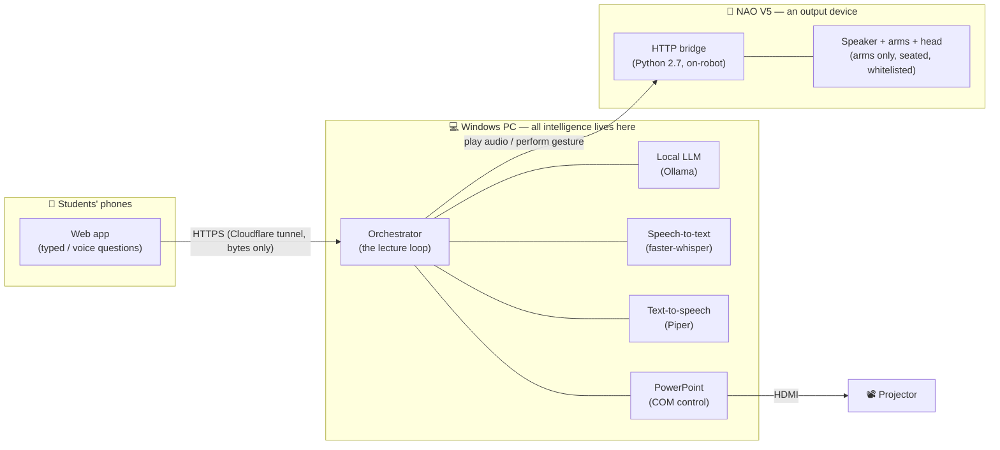

<h1 align="center">🤖 NAO Sensei</h1>

<p align="center">
  <em>A NAO V5 humanoid robot that delivers a real lecture — narrates its own slides, and answers student questions live.</em>
</p>

<p align="center">
  
  
  
  
  
</p>

---

## What it is

**NAO Sensei** is a human–robot interaction (HRI) system in which a **NAO V5** humanoid
delivers a prepared PowerPoint lecture to a small class of students. The robot:

- **narrates** the deck's speaker notes verbatim, section by section,
- **advances its own slides** on the projector,
- **gestures and gazes** naturally as it speaks, and
- **answers student questions** at defined checkpoints — grounded strictly in prepared
  material, never improvised.

Students queue their questions from their **phones** (typed, or spoken via voice), and a
human **operator** supervises the whole lecture from a browser console (pause, skip, end,
recover from faults).

Built as an MVP for a university HRI course. The guiding principle:

> **Brains on the PC, body in the robot.**
> NAO V5 (an Intel Atom CPU) cannot run an LLM, speech recognition, or heavy processing.
> All intelligence runs on a Windows PC; the robot receives only two kinds of command —
> *play this audio* and *perform this gesture*. Everything else follows from that.

---

## How it works



The two hardware targets (audio output, and the robot body) sit behind narrow interfaces
(`AudioSink`, `Body`). Swapping *PC speakers → NAO speakers*, or *console preview → real
robot*, is a one-config-key change — no other module is touched. This is what lets the
whole system be developed and tested on a PC before the robot is ever connected.

---

## Repository layout

```
NAO-SENSEI/
├── app/                      # The PC application (Python 3.11, one asyncio event loop)
│   ├── main.py               #   Entry point — default run mode + --validate flag
│   ├── config.py             #   config.yaml → typed object; fails loudly on missing keys
│   ├── orchestrator.py       #   The lecture loop, written as a readable coroutine
│   ├── state.py              #   Lecture state machine and legal transitions
│   ├── script_parser.py      #   .pptx speaker notes → LectureScript (+ validation)
│   ├── queue.py              #   The student question queue
│   ├── slides.py             #   PowerPoint slide controller + its dedicated COM thread
│   ├── transcript.py         #   Per-lecture session transcript writer
│   ├── audio/                #   AudioSink seam: pc_sink, nao_sink, gapless playback queue
│   ├── body/                 #   Body seam: gesture library, scheduler, console_body, nao_body
│   ├── services/             #   tts · stt · llm · sentence splitting · moderation
│   ├── web/                  #   FastAPI server, student + operator routes, static pages, tunnel
│   └── prompts/              #   Q&A system prompt + spoken filler lines
│
├── nao_bridge/               # Runs ON the robot (Python 2.7) — never imported by the app
│   ├── bridge.py             #   Thin HTTP server: /play, /gesture, /gaze, /leds, /posture…
│   ├── whitelist.py          #   Joint whitelist — structurally refuses any leg-joint command
│   └── restart_bridge.sh     #   Redeploy/restart helper used by the startup script
│
├── content/                  # Authored lecture content (the robot performs, never improvises)
│   ├── lecture.pptx          #   Slides + speaker notes (the verbatim narration script)
│   ├── qa_material.md         #   Grounding source for question answers
│   ├── gestures.yaml         #   Gesture library (joint keyframes), authored in Choregraphe
│   └── behavior.xar          #   Choregraphe source for the gestures (not read at runtime)
│
├── tests/                    # Unit tests: sentence splitter, notes parser, joint whitelist
├── config.yaml               # Every timing, limit, and path — nothing is hardcoded
├── start_nao_sensei.bat      # One-click full-system startup (Ollama + bridge + app)
├── start_nao_sensei.ps1      #   …its actual logic (PowerShell)
│
├── specs.md                  # Full technical specification (v2.2) — the authoritative design
├── implementationPlan.md     # The phased, checkpoint-gated build plan
└── CLAUDE.md                 # Developer log / working notes accumulated across build sessions
```

Empty `logs/`, `sessions/`, `runtime/audio/`, and `voices/` folders are created on demand;
their contents are generated at runtime and are intentionally **not** committed.

---

## Prerequisites

The application runs on **Windows** (it drives PowerPoint over COM). The robot is optional —
the whole system runs in a **console/PC mode** with no robot connected.

| Requirement | Notes |
|---|---|
| **Python 3.11** | Developed under an Anaconda environment; a plain venv works too. |
| **Microsoft PowerPoint** | Desktop app, COM-capable (drives the slideshow). |
| **[Ollama](https://ollama.com)** | Local LLM runtime. Model used: `llama3.1:8b-instruct-q4_K_M`. |
| **[Piper](https://github.com/OHF-Voice/piper1-gpl) voice** | `en_US-ryan-medium` (fetched on demand, see below). |
| **ffmpeg / ffprobe** | On `PATH` (audio format conversion). |
| **[cloudflared](https://developers.cloudflare.com/cloudflare-one/connections/connect-networks/downloads/)** | *Only for voice questions* (Mode B). Typed-only mode needs no tunnel. |
| **NAO V5 + bridge** | *Optional.* Only needed to run on the physical robot. |
| GPU | ~8 GB VRAM recommended so the LLM runs on GPU (verify with `ollama ps`). |

---

## Setup

```bash
# 1. Create and activate an environment (Python 3.11)
conda create -n nao-sensei python=3.11
conda activate nao-sensei

# 2. Install Python dependencies
pip install piper-tts soxr sounddevice numpy python-pptx pywin32 pyyaml \
            fastapi "uvicorn[standard]" httpx "qrcode[pil]" faster-whisper \
            python-multipart pytest

# pywin32 needs a one-time COM registration step:
python <path-to-site-packages>/pywin32_postinstall.py -install

# 3. Fetch the Piper voice model (~63 MB, not committed to the repo)
python -m piper.download_voices --download-dir ./voices en_US-ryan-medium

# 4. Pull the LLM
ollama pull llama3.1:8b-instruct-q4_K_M
```

Everything configurable lives in [`config.yaml`](config.yaml) — audio/body targets, timings,
the projector monitor index, the LLM model, the operator token, and so on. **Nothing is
hardcoded.** Before a real demo, set a real `server.operator_token` and a room-appropriate
`nao.volume`.

---

## Running

### One-click (Windows)

Double-click **`start_nao_sensei.bat`**. It starts Ollama (and warms the model), redeploys
and restarts the NAO bridge, verifies the robot's health, then launches the app — all in a
few seconds from a cold start.

### Manual

```bash
conda activate nao-sensei
python -m app.main                    # run the lecture end-to-end
python -m app.main --validate <deck>  # validate a .pptx deck without running it
```

The app opens PowerPoint, positions the slideshow on the projector display, and then **waits
in `READY`** for the operator to press **Start** — this is deliberate (it gives students time
to connect first), not a hang.

At startup it prints a **student join URL + QR code** and the **operator console URL**. Point
phones at the QR; open the operator console to drive the lecture:

```
http://localhost:8000/operator?token=<server.operator_token>
```

The operator console shows live state, the question queue, component health (LLM/STT/TTS/
PowerPoint/NAO), and the controls: **Pause · Resume · Skip section · Skip question ·
Clear queue · End lecture · Exit**, plus slide-fault recovery (**Reopen deck** /
**Resume without slides**).

### Testing

```bash
python -m pytest tests/        # unit tests (sentence splitter, notes parser, joint whitelist)
python -m tests.smoke_audio    # audio pipeline smoke check
```

---

## Design highlights

- **One asyncio event loop, no locks.** All mutable state is read/written from a single
  thread; worker threads only return values or post back. Concurrency is a design invariant,
  not an afterthought.
- **Two swap seams (`AudioSink`, `Body`).** PC ↔ robot is a config-key change, validated by
  diffing — no conditional on the output target leaks into the rest of the codebase.
- **Structural motor safety.** The on-robot bridge enforces a **joint whitelist**: the robot
  is seated for the entire lecture and *no command can move a leg joint* — refused at the
  bridge, not by convention. Gestures are validated against real NAO V5 joint limits at load.
- **Grounded Q&A only.** The LLM answers strictly from the prepared `qa_material.md`; a
  moderation guardrail and grounding checks keep it from improvising or repeating
  inappropriate input.
- **Fails loudly, degrades gracefully.** Missing config or an un-narrated slide is a hard
  startup error; a mid-lecture failure in Ollama or STT degrades Q&A but never stops the
  lecture.

---

## 100% local inference

All AI inference — speech recognition, the language model, and speech synthesis — runs
**locally on the PC**. No cloud AI service is ever called. The *only* external dependency is
an optional **Cloudflare quick tunnel** used purely as HTTPS transport for voice questions
(phones require a secure context to use the microphone); it relays bytes and performs no
inference. In the default typed-only mode the system is fully offline. See `specs.md` §2
(NFR-1) and §9.1 for the full rationale and the privacy note.

---

## Documentation

| File | What it is |
|---|---|
| [`specs.md`](specs.md) | The authoritative technical specification (v2.2) — requirements, architecture, every seam and safety guarantee. |
| [`implementationPlan.md`](implementationPlan.md) | The phased, checkpoint-gated build plan the project was implemented against. |
| [`CLAUDE.md`](CLAUDE.md) | The developer log — working rules and a session-by-session account of what was built, tested on real hardware, and fixed. |

---

## Authors

- **Michael Naftalishen**
- **Yossef Okropiridze**

Developed for a university course on software development for human–robot interaction with a
humanoid robot.

## License

Released under the **[MIT License](LICENSE)** © 2026 Michael Naftalishen & Yossef Okropiridze.

You are free to use, modify, and build on this project — the one condition is that the
copyright notice and license text above are kept in any copy or substantial portion. If you
use it in your own work, an attribution or citation (see [`CITATION.cff`](CITATION.cff)) is
appreciated.
