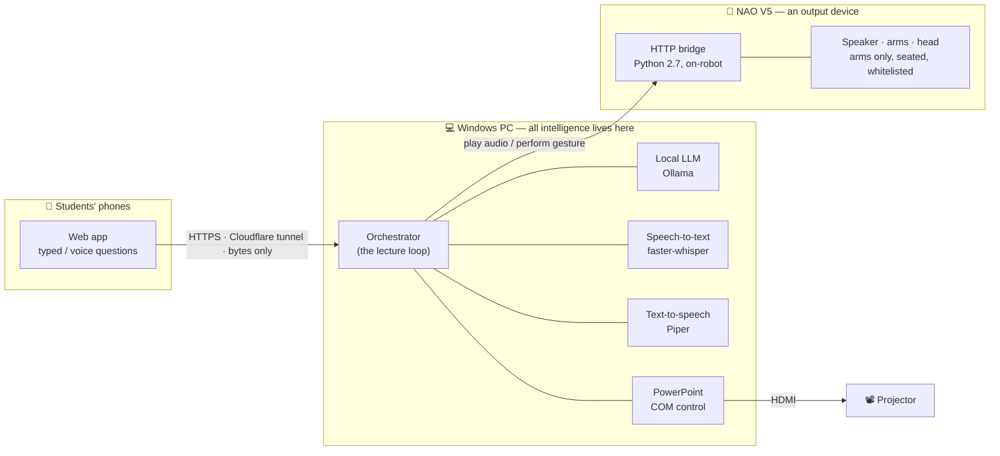
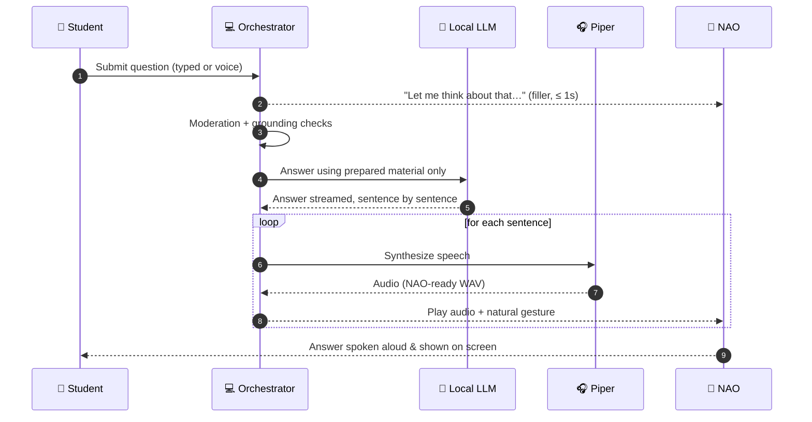

<div align="center">

# 🤖 NAO Sensei

### A humanoid robot that teaches a real class — and answers back.

*A NAO V5 stands at the front of the room, narrates its own slides, gestures as it speaks,*
*and takes live questions from students' phones — all with zero cloud AI.*

<br>


</div>

---

> **The one-sentence version.** A NAO V5 humanoid delivers a prepared lecture to a small
> class: it reads the speaker notes aloud, advances its own slides, and — at set checkpoints —
> answers questions students queue from their phones, grounded strictly in prepared material.
> **All the intelligence runs on a Windows PC; the robot is just the body.**

<div align="center">

**[Quick start](#-quick-start) · [How it works](#-how-it-works) · [Install](#-installation) · [Run a lecture](#-running-a-lecture) · [Docs](#-documentation)**

</div>

---

## 📖 Table of contents

- [Why it's interesting](#-why-its-interesting)
- [Quick start](#-quick-start)
- [How it works](#-how-it-works)
  - [The system at a glance](#the-system-at-a-glance)
  - [A student question, end to end](#a-student-question-end-to-end)
- [Getting started](#-getting-started)
  - [Prerequisites](#prerequisites)
  - [Installation](#-installation)
  - [Configuration](#-configuration)
- [Running a lecture](#-running-a-lecture)
- [Testing](#-testing)
- [Project structure](#-project-structure)
- [Design & safety](#-design--safety)
- [Documentation](#-documentation)
- [Acknowledgements](#-acknowledgements)
- [Authors](#-authors)
- [License](#-license)

---

## ✨ Why it's interesting

- 🎙️ **Verbatim narration** of a real PowerPoint deck, with natural pacing, pauses, and gaze.
- 🖥️ **Self-advancing slides** on the projector, driven directly over COM.
- 🙋 **Live student Q&A** at checkpoints — typed *or* spoken from any phone, no app to install.
- 🧠 **Grounded answers only** — a local LLM answers strictly from prepared material, behind a
  moderation guardrail. It never improvises facts.
- 🤖 **Believable embodiment** — arm gestures, gaze, and eye-LED states, every one safety-limited.
- 🔒 **100% local inference** — speech, language, and voice all run on the PC. No cloud AI, ever.
- 🧪 **Runs without the robot** — a PC/console mode lets you build and test the whole thing
  end-to-end before a NAO is ever plugged in.

> **Guiding principle — brains on the PC, body in the robot.**
> A NAO V5 runs on an Intel Atom CPU; it can't host an LLM, speech recognition, or heavy
> processing. So it receives just two kinds of command — *play this audio* and *perform this
> gesture* — and every design decision follows from that.

---

## 🚀 Quick start

> Full details in [Installation](#-installation). This is the "I just want to see it run" path
> — it works **without a robot**, on the PC's own speakers.

```bash
# 1. Clone + enter
git clone https://github.com/michael-naf/NAO-Sensei.git
cd NAO-Sensei

# 2. Environment + dependencies (Python 3.11)
conda create -n nao-sensei python=3.11 && conda activate nao-sensei
pip install -r requirements.txt

# 3. Fetch the voice model and the language model
python -m piper.download_voices --download-dir ./voices en_US-ryan-medium
ollama pull llama3.1:8b-instruct-q4_K_M

# 4. Run it
python -m app.main
```

The app opens the slides, then **waits in `READY`** and prints a student QR code and an
operator console link. Open the console, press **Start**, and the lecture begins. 🎓

---

## 🧭 How it works

### The system at a glance



The two hardware targets — **audio output** and the **robot body** — sit behind narrow
interfaces (`AudioSink`, `Body`). Swapping *PC speakers → NAO speakers*, or *console preview
→ real robot*, is a **one-config-key change**; no other module is touched. That single seam
is what lets the entire system be developed and tested on a PC long before the robot exists.

### A student question, end to end

What actually happens between a student tapping "send" and NAO speaking the answer:



NAO starts *reacting* within a second (the filler masks model latency), and the grounded
answer follows. If the material doesn't cover the question, the guardrail makes NAO say so
rather than guess.

---

## 🛠️ Getting started

> **Platform note.** The app runs on **Windows** (it drives the PowerPoint desktop app over
> COM). The physical robot is **optional** — everything runs in a PC/console mode with no
> robot attached.

### Prerequisites

Install these first — they are **not** pip packages:

| Tool | Why it's needed | Required? |
|---|---|---|
| **[Python 3.11](https://www.python.org/downloads/)** | Runs the application. | Always |
| **Microsoft PowerPoint** (desktop) | Displays and advances the slides (COM). | Always |
| **[Ollama](https://ollama.com)** | Runs the local LLM that answers questions. | Always |
| **[ffmpeg + ffprobe](https://ffmpeg.org/download.html)** | Audio format conversion (on `PATH`). | Always |
| **[cloudflared](https://developers.cloudflare.com/cloudflare-one/connections/connect-networks/downloads/)** | HTTPS tunnel so phones can use the microphone. | Voice questions only |
| **NAO V5 + [Choregraphe](https://www.aldebaran.com/en/support/nao-6/downloads-softwares)** | The physical robot and its gesture-authoring tool. | Physical robot only |

> 💡 A GPU with **~8 GB VRAM** is recommended so the LLM runs on the GPU (check with `ollama ps`).

### 📦 Installation

```bash
# 1. Clone the repository
git clone https://github.com/michael-naf/NAO-Sensei.git
cd NAO-Sensei

# 2. Create and activate a Python 3.11 environment
conda create -n nao-sensei python=3.11
conda activate nao-sensei
#   (a plain venv works too: python -m venv .venv && .venv\Scripts\activate)

# 3. Install the Python dependencies
pip install -r requirements.txt

# 4. One-time COM registration for pywin32
python <path-to-site-packages>/pywin32_postinstall.py -install
```

**5. Download the text-to-speech voice** (a ~63 MB binary, *not* committed to the repo) into
the `voices/` folder:

```bash
python -m piper.download_voices --download-dir ./voices en_US-ryan-medium
```

This produces the two files the app expects — the name must match `tts.voice` in `config.yaml`:

```
voices/
├── en_US-ryan-medium.onnx        # the voice model
└── en_US-ryan-medium.onnx.json   # its config
```

**6. Pull the language model** into Ollama (must match `llm.model` in `config.yaml`):

```bash
ollama pull llama3.1:8b-instruct-q4_K_M
```

### ⚙️ Configuration

All settings live in two files — **nothing is hardcoded in the source**:

| File | What it holds | Committed? |
|---|---|---|
| [`config.yaml`](config.yaml) | Every application setting (see below). | ✅ Yes |
| `.env` | Machine-specific paths for the **one-click startup script only** — your Python interpreter, the robot's address, your SSH key. Copy it from [`.env.example`](.env.example). | ❌ No — git-ignored |

**What's inside `config.yaml`** — one commented file that groups all the knobs. You rarely
need to touch most of them:

| Section | What it controls |
|---|---|
| `audio_output` / `body` | Whether output goes to the **PC** or a **real NAO robot**. |
| `llm` | The language model and how answers are generated. |
| `tts` / `stt` | The voice (text-to-speech) and speech recognition. |
| `slides` | **Which screen** the slideshow appears on (see note below). |
| `server` | The web server, the phone tunnel, and the operator password. |
| `timings` / `gestures` / `nao` | Pacing, robot gestures, and the robot's address & volume. |

The shipped defaults run **without a robot** (`audio_output: pc`, `body: console`). Set both
to `nao` to drive a real NAO V5. Before any real demo, also set a real `server.operator_token`
and a room-appropriate `nao.volume`.

> 🖥️ **Which screen shows the slides.** PowerPoint displays the slideshow on the monitor set
> by `slides.display` in `config.yaml`: `1` is your primary screen, `2` a second monitor or
> projector, and so on. The default is `2` (a projector). **If you only have one screen, set
> it to `1`** — otherwise the app stops at startup with a clear *"only N monitor(s) connected"*
> message.

---

## 🎓 Running a lecture

### Option A — manual (works on any machine)

```bash
conda activate nao-sensei
python -m app.main                    # run the lecture end-to-end
python -m app.main --validate <deck>  # just validate a .pptx, don't run it
```

The app opens PowerPoint, positions the slideshow, then **waits in `READY`** for the operator
to press **Start** — this is deliberate (it lets students connect first), *not* a hang.

At startup it prints a **student join URL + QR code** and the **operator console URL**. Point
phones at the QR, open the console, and press **Start**:

```
http://localhost:8000/operator?token=<your operator_token>
```

The console shows live state, the question queue, and component health
(LLM / STT / TTS / PowerPoint / NAO), with controls for
**Pause · Resume · Skip section · Skip question · Clear queue · End lecture · Exit**, plus
slide-fault recovery (**Reopen deck** / **Resume without slides**).

### Option B — one-click (this project's machine)

Double-click **`start_nao_sensei.bat`**. It starts Ollama, warms the model, redeploys and
restarts the on-robot bridge, then launches the app. It reads your machine paths from `.env`
(see [Configuration](#-configuration)), so set that up first. The manual commands above need
no `.env`.

---

## 🧪 Testing

```bash
python -m pytest tests/        # unit tests: sentence splitter, notes parser, joint whitelist
python -m tests.smoke_audio    # audio-pipeline smoke check
```

---

## 🗂️ Project structure

The top-level map:

| Path | What lives here |
|---|---|
| `app/` | The main program that runs on the PC — the "brains" of the whole system. |
| `nao_bridge/` | A small program that runs **on the robot** and just relays commands to it. |
| `content/` | The lecture itself: the slides, the speaker notes, the Q&A facts, and the robot's gestures. |
| `tests/` | Automated checks. |
| `voices/` | The downloaded voice file (not included — you fetch it during setup). |

Inside `app/`, in plain terms:

```
app/
├── main.py            # Starts everything up
├── config.py          # Reads the settings from config.yaml
├── orchestrator.py    # Runs the lecture from start to finish
├── state.py           # Keeps track of what's happening right now
├── script_parser.py   # Reads the speaker notes out of the slides
├── slides.py          # Opens PowerPoint and advances the slides
├── queue.py           # The line of student questions waiting to be answered
├── transcript.py      # Saves a written record of each lecture
├── audio/             # Turns text into speech and plays it out loud
├── body/              # The robot's gestures, gaze, and eye lights
├── services/          # The AI parts: hearing, answering, and speaking
├── web/               # The students' phone page and the operator's control page
└── prompts/           # The wording the robot uses when it answers
```

The `logs/`, `sessions/`, and `runtime/audio/` folders are kept in the repo, but the files
they fill up with while running are not.

---

## 🛡️ Design & safety

- **One event loop, no locks.** All mutable state is read and written from a single thread;
  worker threads only return values or post back. Concurrency is a design invariant, not an
  afterthought.
- **Two swap seams (`AudioSink`, `Body`).** PC ↔ robot is a config-key change, so no
  conditional on the output target ever leaks into the rest of the codebase.
- **Structural motor safety.** The on-robot bridge enforces a **joint whitelist**: the robot
  stays seated for the whole lecture and *no command can move a leg joint* — refused at the
  bridge, not by convention. Every gesture is validated against real NAO V5 joint limits.
- **Grounded Q&A only.** The LLM answers strictly from the prepared material; a moderation
  guardrail and grounding checks stop it improvising facts or repeating inappropriate input.
- **Fails loudly, degrades gracefully.** Missing config or an un-narrated slide is a hard
  startup error; a mid-lecture failure in Ollama or STT degrades Q&A but never stops the
  lecture.

### 🔒 100% local inference

All AI inference — speech recognition, the language model, and speech synthesis — runs
**locally on the PC**. No cloud AI service is ever called. The *only* external dependency is
an optional **Cloudflare quick tunnel** used purely as HTTPS transport for voice questions
(phones need a secure context to reach the microphone); it relays bytes and performs no
inference. In the default typed-only mode the system is fully offline. See `specs.md` §2
(NFR-1) and §9.1 for the full rationale and privacy note.

---

## 📚 Documentation

| File | What it is |
|---|---|
| [`specs.md`](specs.md) | The authoritative technical specification (v2.2) — requirements, architecture, every seam and safety guarantee. |
| [`implementationPlan.md`](implementationPlan.md) | The phased, checkpoint-gated build plan the project was implemented against. |

---

## 🙏 Acknowledgements

This project builds on excellent open-source work — each retains its own license:

- **[Ollama](https://ollama.com)** running **Meta Llama 3.1** — the local model that answers
  questions. *Built with Llama* ([Llama 3.1 Community License](https://github.com/meta-llama/llama-models/blob/main/models/llama3_1/LICENSE)).
- **[Piper](https://github.com/OHF-Voice/piper1-gpl)** — neural text-to-speech; voice
  `en_US-ryan-medium` (RyanSpeech dataset).
- **[faster-whisper](https://github.com/SYSTRAN/faster-whisper)** — speech-to-text (OpenAI Whisper).
- **[FastAPI](https://fastapi.tiangolo.com/)** + **[Uvicorn](https://www.uvicorn.org/)** — the student & operator web apps.
- **[python-pptx](https://python-pptx.readthedocs.io/)** — reads the deck's speaker notes.
- **[Cloudflare Tunnel](https://developers.cloudflare.com/cloudflare-one/connections/connect-networks/)** (`cloudflared`) — HTTPS transport for phone microphone access.
- **[Aldebaran / SoftBank Robotics](https://www.aldebaran.com/)** — the NAO V5 platform and Choregraphe.

---

## 👥 Authors

- **Michael Naftalishen**
- **Yossef Okropiridze**

Developed for a university course on software development for human–robot interaction with a
humanoid robot.

## 📄 License

Released under the **[MIT License](LICENSE)** © 2026 Michael Naftalishen & Yossef Okropiridze.

You're free to use, modify, and build on this project — the one condition is that the
copyright notice and license text are kept in any copy or substantial portion. If you use it
in your own work, an attribution or citation (see [`CITATION.cff`](CITATION.cff)) is
appreciated.

<div align="center">
<br>
<sub>Built with ☕ and a very patient robot.</sub>
</div>
