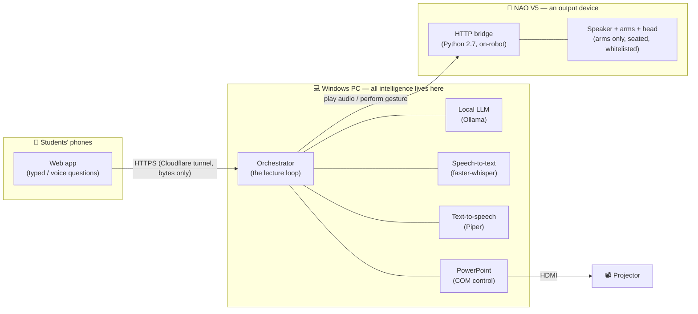

<h1 align="center">🤖 NAO Sensei</h1>

<p align="center">
  <em>A NAO V5 humanoid robot that delivers a real lecture — it narrates its own slides and answers student questions live.</em>
</p>

<p align="center">
  
  
  
  
</p>

<p align="center">
  
  
  
  
  
  
  
</p>

---

## Table of contents

- [What it is](#what-it-is)
- [Features](#features)
- [How it works](#how-it-works)
- [Getting started](#getting-started)
  - [1. Prerequisites](#1-prerequisites)
  - [2. Installation](#2-installation)
  - [3. Configuration](#3-configuration)
- [Running a lecture](#running-a-lecture)
- [Testing](#testing)
- [Project structure](#project-structure)
- [Design & safety notes](#design--safety-notes)
- [Documentation](#documentation)
- [Acknowledgements](#acknowledgements)
- [Authors](#authors)
- [License](#license)

---

## What it is

**NAO Sensei** is a human–robot interaction (HRI) system in which a **NAO V5** humanoid
delivers a prepared PowerPoint lecture to a small class of students. The robot:

- **narrates** the deck's speaker notes verbatim, section by section,
- **advances its own slides** on the projector,
- **gestures and gazes** naturally as it speaks, and
- **answers student questions** at defined checkpoints — grounded strictly in prepared
  material, never improvised.

Students queue their questions from their **phones** (typed, or spoken via voice), and a
human **operator** supervises the lecture from a browser console (pause, skip, end, recover
from faults).

It was built as an MVP for a university HRI course. The guiding principle:

> **Brains on the PC, body in the robot.**
> NAO V5 (an Intel Atom CPU) cannot run an LLM, speech recognition, or heavy processing.
> All intelligence runs on a Windows PC; the robot receives only two kinds of command —
> *play this audio* and *perform this gesture*. Everything else follows from that.

---

## Features

- 🎙️ **Verbatim narration** of a real PowerPoint deck, with natural pacing and pauses.
- 🖥️ **Self-advancing slides** projected on a second monitor, driven over COM.
- 🙋 **Live student Q&A** at checkpoints — typed or spoken from any phone, no app install.
- 🧠 **Grounded answers only** — a local LLM answers strictly from prepared material, with a
  moderation guardrail; it never improvises facts.
- 🤖 **Natural embodiment** — arm gestures, gaze, and eye-LED states, all safety-limited.
- 🎛️ **Operator console** — pause, resume, skip, clear queue, end, and slide-fault recovery.
- 🔒 **100% local inference** — speech, language, and voice all run on the PC; no cloud AI.
- 🧪 **Runs without the robot** — a console/PC mode lets you develop and test end-to-end
  before NAO is ever connected.

---

## How it works



The two hardware targets — audio output, and the robot body — sit behind narrow interfaces
(`AudioSink`, `Body`). Swapping *PC speakers → NAO speakers*, or *console preview → real
robot*, is a **one-config-key change**; no other module is touched. That is what lets the
whole system be built and tested on a PC before the robot is connected.

---

## Getting started

> **Platform note.** The application runs on **Windows** — it drives the PowerPoint desktop
> app over COM. The physical robot is **optional**: the whole system runs in a console/PC
> mode with no robot connected.

### 1. Prerequisites

Install these **before** the Python packages. They are not pip packages.

| Tool | Why it's needed | Required? |
|---|---|---|
| **[Python 3.11](https://www.python.org/downloads/)** | Runs the application. | Always |
| **Microsoft PowerPoint** (desktop) | Displays and advances the slides (via COM). | Always |
| **[Ollama](https://ollama.com)** | Runs the local LLM that answers questions. | Always |
| **[ffmpeg + ffprobe](https://ffmpeg.org/download.html)** | Audio format conversion (on `PATH`). | Always |
| **[cloudflared](https://developers.cloudflare.com/cloudflare-one/connections/connect-networks/downloads/)** | HTTPS tunnel so phones can use the microphone. | Voice questions only |
| **NAO V5 robot + [Choregraphe](https://www.aldebaran.com/en/support/nao-6/downloads-softwares)** | The physical robot and its gesture-authoring tool. | Physical robot only |

A GPU with **~8 GB VRAM** is recommended so the LLM runs on the GPU (verify with `ollama ps`).

### 2. Installation

```bash
# 1. Clone the repository
git clone https://github.com/michael-naf/NAO-Sensei.git
cd NAO-Sensei

# 2. Create and activate a Python 3.11 environment
conda create -n nao-sensei python=3.11
conda activate nao-sensei
#   (a plain venv works too: python -m venv .venv && .venv\Scripts\activate)

# 3. Install the Python dependencies
pip install -r requirements.txt

# 4. One-time COM registration for pywin32
python <path-to-site-packages>/pywin32_postinstall.py -install
```

**5. Download the text-to-speech voice model.** It is a large binary (~63 MB) and is *not*
committed to the repo. Fetch it into the `voices/` folder:

```bash
python -m piper.download_voices --download-dir ./voices en_US-ryan-medium
```

This creates the two files the app expects:

```
voices/
├── en_US-ryan-medium.onnx        # the voice model
└── en_US-ryan-medium.onnx.json   # its config
```

The voice name in `config.yaml` (`tts.voice`) must match these filenames.

**6. Pull the language model** into Ollama:

```bash
ollama pull llama3.1:8b-instruct-q4_K_M
```

This must match `llm.model` in `config.yaml`.

### 3. Configuration

Two files hold all settings — **nothing is hardcoded in the source**:

| File | What it holds | Committed? |
|---|---|---|
| [`config.yaml`](config.yaml) | Every application setting: the audio/body targets, the LLM model, timings, the projector monitor index, the operator token, the robot address, etc. | Yes |
| `.env` | Machine-specific paths used **only** by the one-click startup script (your Python interpreter, the robot's address, your SSH key). | **No** — git-ignored |

For the one-click script, copy the template and fill in your own paths:

```bash
copy .env.example .env       # Windows
```

Before a real demo, set a real `server.operator_token` and a room-appropriate `nao.volume`
in `config.yaml`.

---

## Running a lecture

You can run **with or without** the robot — set `audio_output` and `body` in `config.yaml`
(`pc`/`console` for no robot, `nao`/`nao` for the real robot).

### Option A — manual (works on any machine)

```bash
conda activate nao-sensei
python -m app.main                    # run the lecture end-to-end
python -m app.main --validate <deck>  # just validate a .pptx without running it
```

The app opens PowerPoint, positions the slideshow on the projector, and then **waits in
`READY`** for the operator to press **Start** — this is deliberate (it gives students time to
connect first), *not* a hang.

At startup it prints a **student join URL + QR code** and the **operator console URL**. Point
the phones at the QR code, then open the operator console and press **Start**:

```
http://localhost:8000/operator?token=<your operator_token>
```

The operator console shows live state, the question queue, and component health
(LLM / STT / TTS / PowerPoint / NAO), with controls for **Pause · Resume · Skip section ·
Skip question · Clear queue · End lecture · Exit**, plus slide-fault recovery
(**Reopen deck** / **Resume without slides**).

### Option B — one-click (this project's machine)

Double-click **`start_nao_sensei.bat`**. It starts Ollama, warms the model, redeploys and
restarts the on-robot bridge, then launches the app. It reads your machine paths from `.env`
(see [Configuration](#3-configuration)) — so set that up first. The manual commands above
need no `.env`.

---

## Testing

```bash
python -m pytest tests/        # unit tests (sentence splitter, notes parser, joint whitelist)
python -m tests.smoke_audio    # audio-pipeline smoke check
```

---

## Project structure

A high-level map — the top-level folders are:

| Path | What lives here |
|---|---|
| `app/` | The PC application (Python 3.11). The lecture runs as one asyncio coroutine. |
| `nao_bridge/` | A tiny HTTP server that runs **on the robot** (Python 2.7). Never imported by `app/`. |
| `content/` | The authored lecture: slides + speaker notes, Q&A material, and the gesture library. |
| `tests/` | Unit tests. |
| `voices/` | The Piper voice model (downloaded, not committed). |

Inside `app/`:

```
app/
├── main.py            # Entry point (default run + --validate)
├── config.py          # Loads config.yaml into a typed object
├── orchestrator.py    # The lecture loop, written as a readable coroutine
├── state.py           # Lecture state machine
├── script_parser.py   # .pptx speaker notes → lecture script (+ validation)
├── slides.py          # PowerPoint control (its own COM thread)
├── queue.py           # The student question queue
├── transcript.py      # Per-lecture transcript writer
├── audio/             # AudioSink seam: PC / NAO output + gapless playback
├── body/              # Body seam: gesture library, scheduler, console / NAO body
├── services/          # tts · stt · llm · sentence splitting · moderation
├── web/               # FastAPI server, student + operator pages, phone tunnel
└── prompts/           # Q&A system prompt + spoken filler lines
```

The `logs/`, `sessions/`, and `runtime/audio/` folders exist in the repo but their
generated contents are intentionally not committed.

---

## Design & safety notes

- **One event loop, no locks.** All mutable state is read/written from a single thread;
  worker threads only return values or post back. Concurrency is a design invariant.
- **Two swap seams (`AudioSink`, `Body`).** PC ↔ robot is a config-key change, so no
  conditional on the output target leaks into the rest of the codebase.
- **Structural motor safety.** The on-robot bridge enforces a **joint whitelist**: the robot
  is seated for the whole lecture and *no command can move a leg joint* — refused at the
  bridge, not by convention. Gestures are validated against real NAO V5 joint limits.
- **Grounded Q&A only.** The LLM answers strictly from the prepared material; a moderation
  guardrail and grounding checks stop it improvising or repeating inappropriate input.
- **Fails loudly, degrades gracefully.** Missing config or an un-narrated slide is a hard
  startup error; a mid-lecture failure in Ollama or STT degrades Q&A but never stops the
  lecture.

### 100% local inference

All AI inference — speech recognition, the language model, and speech synthesis — runs
**locally on the PC**. No cloud AI service is ever called. The *only* external dependency is
an optional **Cloudflare quick tunnel** used purely as HTTPS transport for voice questions
(phones need a secure context to use the microphone); it relays bytes and performs no
inference. In the default typed-only mode the system is fully offline. See `specs.md` §2
(NFR-1) and §9.1 for the full rationale and privacy note.

---

## Documentation

| File | What it is |
|---|---|
| [`specs.md`](specs.md) | The authoritative technical specification (v2.2) — requirements, architecture, every seam and safety guarantee. |
| [`implementationPlan.md`](implementationPlan.md) | The phased, checkpoint-gated build plan the project was implemented against. |
| [`CLAUDE.md`](CLAUDE.md) | The developer log — working rules and a session-by-session account of what was built, tested on hardware, and fixed. |

---

## Acknowledgements

This project builds on excellent open-source work — each retains its own license:

- **[Ollama](https://ollama.com)** running **Meta Llama 3.1** — the local model that answers
  questions. *Built with Llama* ([Llama 3.1 Community License](https://github.com/meta-llama/llama-models/blob/main/models/llama3_1/LICENSE)).
- **[Piper](https://github.com/OHF-Voice/piper1-gpl)** — neural text-to-speech; voice
  `en_US-ryan-medium` (RyanSpeech dataset).
- **[faster-whisper](https://github.com/SYSTRAN/faster-whisper)** — speech-to-text (OpenAI Whisper).
- **[FastAPI](https://fastapi.tiangolo.com/)** + **[Uvicorn](https://www.uvicorn.org/)** — the student & operator web apps.
- **[python-pptx](https://python-pptx.readthedocs.io/)** — reads the deck's speaker notes.
- **[Cloudflare Tunnel](https://developers.cloudflare.com/cloudflare-one/connections/connect-networks/)** (`cloudflared`) — HTTPS transport for phone microphone access.
- **[Aldebaran / SoftBank Robotics](https://www.aldebaran.com/)** — the NAO V5 platform and Choregraphe.

---

## Authors

- **Michael Naftalishen**
- **Yossef Okropiridze**

Developed for a university course on software development for human–robot interaction with a
humanoid robot.

## License

Released under the **[MIT License](LICENSE)** © 2026 Michael Naftalishen & Yossef Okropiridze.

You are free to use, modify, and build on this project — the one condition is that the
copyright notice and license text are kept in any copy or substantial portion. If you use it
in your own work, an attribution or citation (see [`CITATION.cff`](CITATION.cff)) is
appreciated.
